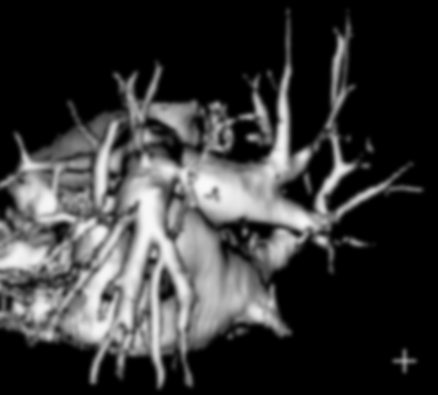
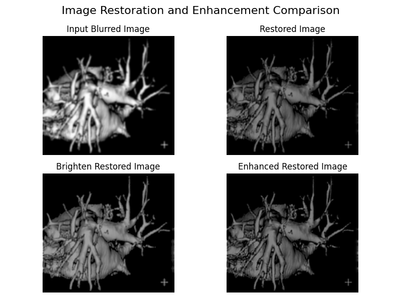
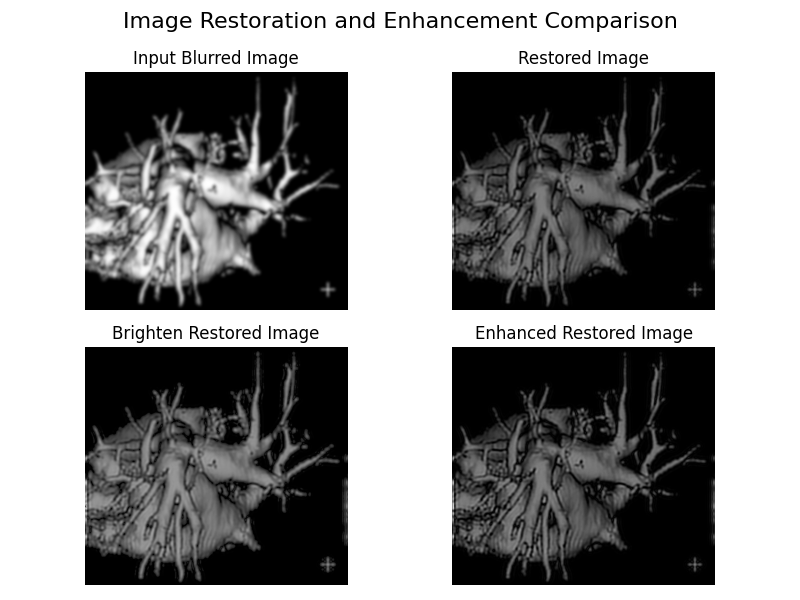

# Image Restoration in Frequency Domain

## Problem Statement

### Problem
Given a blurred image of a heart, the task is to recover the degraded function $H(u,v)$. It is known that, the bottom right corner crosshair image before degraded, is 3 pixels wide, 30 pixels long, and had an intensity of 255.

Further more, try to restore the original image.

The heart image is given as follow:

  
  
<em>Blurred heart image</em>

### Assumptions

Upon solving this problem, we consider the following assumptions:
- <b>Noise removed:</b> We consider the image is not corrupted by noise, e.g. no salt or pepper, hence absence of smoothing the image.
- <b>Gaussian or Butterworth:</b> We assume the blurred image is filtered using Gaussian or Butterworth lowpass filters, other techiques are not considered.

## Approach

TODO

## Experimental Results

### Gaussian estimator

  
  
<em>Gaussian lowpass estimated results</em>

### Butterworth estimator

  
  
<em>Butterworth lowpass estimated results</em>

